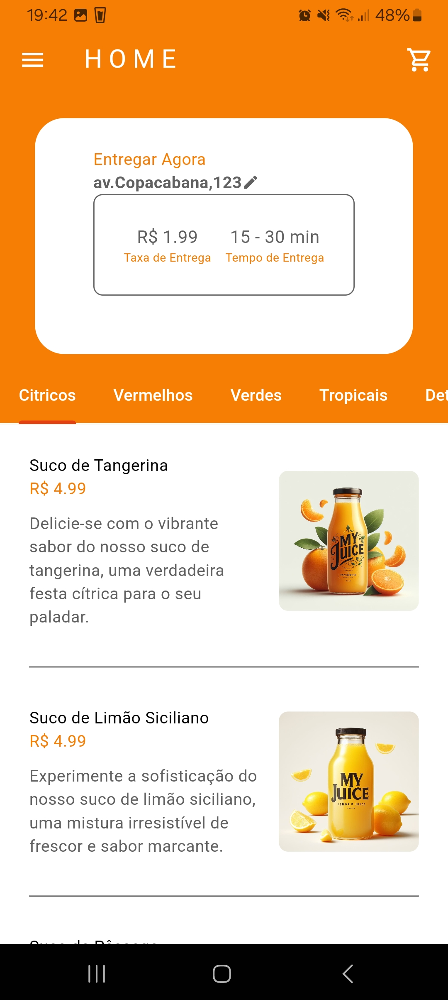

# 📱Aplicativo Delivery My Juice🤳🏼

## **PT-BR**
## 📄Descrição
Este projeto consiste no projeto final para a disciplina de Mobile System do Curso de Ciência da Computação. Esse projeto foi executado em uma equipe de três pessoas e se trata de um aplicativo delivery de sucos.

## 📸Capturas de Tela




## ⚙️Tecnologias Utilizadas
- Android Studio: IDE para a criação do projeto;
- Flutter(Dart): Linguagem de programação que estrutura o projeto;
- Firebase: Para autenticação e como banco de dados;
- Microsoft Copilot: Imagens fictícias dos produtos;

## 🛠️Funcionalidades
- Realizar cadastro e login/logout;
- O app permite ao usuário explorar os diversos sabores oferecidos pelo app, por meio de categorias de suco;
- Fazer pedido de sucos adicionando os sucos desejados no carrinho de compras;
- Limpar o carrinho de compras;
- Gerar comprovante de pedido/pagamento;
- Realizar pagamento via cartão;
- Adicionar endereço de entrega;
- Possibilita contato com o entregador via ligação;
- Acessar histórico de pedidos;

## 🦾Habilidades utilizadas para a construção da app
- Utilização do Firebase Authentication para fazer a validação das contas dos usuários cadastrados no app;
- Utilização do Firestore Database para armazenar os pedidos dos clientes, assim como a coleção dos sucos oferecidos pelo app;
- Conceitos básicos do Flutter, como widgets, estado, gerenciamento de estado, navegação e hot reload.
- Conceitos de interface de usuário (UI) para criar uma interface de usuário bonita e responsiva.

## 📌Observações
- Todas as imagens dos sucos foram geradas por IA (Copilot) para que pudessem compor o projeto.

## 📲Baixando e Executando o projeto
### Pré-requisitos:
- Android Studio
- Dispositivo Android

### Passos:
1. Clonar o repositório ou fazer o download direto do arquivo compactado;
2. Instalar o Flutter (se necessário); 
3. Abrir o projeto no Android Studio:
- Abra o Android Studio no computador.
- Clique em "Abrir" e selecione a pasta do projeto Flutter que você baixou.
- O Android Studio importará o projeto e configurará as ferramentas de desenvolvimento necessárias.
4. Executar o aplicativo:
- Conecte o dispositivo Android ao computador via USB.
- Certifique-se de que a depuração USB esteja habilitada no dispositivo.
- No Android Studio, clique no botão "Executar" ou pressione ```Ctrl+F11``` (Windows/Linux) ou ```Cmd+D``` (macOS).
- O Android Studio instalará e executará o aplicativo no dispositivo Android conectado.

### Observações:
- Se você estiver usando um emulador virtual, certifique-se de que ele esteja configurado e iniciado corretamente no Android Studio.
- Se você encontrar problemas ao executar o aplicativo, verifique o log do console no Android Studio para obter mais informações.

## ®️Licença
Este projeto está sobre Licença MIT.

## 📚Documentação
- [Flutter](https://docs.flutter.dev/)
- [Android Studio](https://developer.android.com/develop)
- [Firebase](https://firebase.google.com/docs?hl=pt-br)

-------------------------------------------------------------------
# My Juice Delivery App

## **EN-US**
📄Description
This project is the final project for the Mobile System course in Computer Science. This project was carried out in a team of three people and is a juice delivery app.

## 📸Screenshots


## ⚙️Technologies
- Android Studio: IDE for creating the project;
- Flutter(Dart): Programming language that structures the project;
- Firebase: For authentication and as a database;
- Microsoft Copilot: Fictitious product images;

## 🛠️Features
- Register and login/logout;
- The app allows the user to explore the various flavors offered by the app, through juice categories;
- Order juices by adding the desired juices to the shopping cart;
- Clear the shopping cart;
- Generate proof of order/payment;
- Make payment by card;
- Add delivery address;
- Enable contact with the delivery person via phone call;
- Access order history;

## 🦾 Skills used to build this app
- Use of Firebase Authentication to validate the accounts of users registered in the app;
- Use of the Firestore Database to store customer orders, as well as the collection of juices offered by the app;
- Basic Flutter concepts, such as widgets, status, status management, navigation and hot reload.
- User interface (UI) concepts to create a beautiful and responsive user interface.

## 📌Observations
- All the images of the juices were generated by AI (Copilot) so that they could make up the project.

## 📲Downloading and running the project
### Requirements:
- Android Studio
- Android device
### Steps:
1. Clone the repository or download the compressed file directly;
2. Install Flutter (if necessary);
3. Open the project in Android Studio:
- Open Android Studio on your computer.
- Click on “Open” and select the folder of the Flutter project you downloaded.
- Android Studio will import the project and configure the necessary development tools.
4. Run the application:
- Connect the Android device to the computer via USB.
- Make sure USB debugging is enabled on the device.
- In Android Studio, click on the “Run” button or press ```Ctrl+F11``` (Windows/Linux) or ```Cmd+D``` (macOS).
- Android Studio will install and run the application on the connected Android device.
### Notes:
- If you are using a virtual emulator, make sure it is configured and started correctly in Android Studio.
- If you encounter problems running the application, check the console log in Android Studio for more information.

## ®️License
This project is under the MIT License.

## 📚Documentation
- [Flutter](https://docs.flutter.dev/)
- [Android Studio](https://developer.android.com/develop)
- [Firebase](https://firebase.google.com/docs?hl=pt-br)
